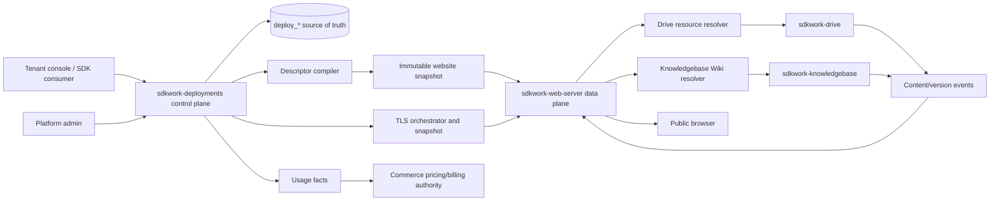

# ADR-20260721 Unified Cloud Site Publishing Control Plane

Status: proposed
Requirement: REQ-2026-0001
Owner: SDKWork Deploy maintainers
Date: 2026-07-21
Specs: ARCHITECTURE_DECISION_SPEC.md, DOMAIN_SPEC.md, DATABASE_SPEC.md, DRIVE_SPEC.md,
SDK_SPEC.md, APP_SDK_INTEGRATION_SPEC.md, DEPLOYMENT_SPEC.md, SECURITY_SPEC.md,
OBSERVABILITY_SPEC.md, MIGRATION_SPEC.md

## Context

Drive, Knowledgebase, Deploy, and Web Server each own necessary capabilities, but existing models can
create two harmful coupling patterns: publishing a full release for every content change, or letting
source products create their own site/domain/certificate control planes. Web Server also contains
legacy writable `web_*` management tables overlapping Deploy `deploy_*` tables.

The product needs directory-faithful publication, live Wiki projection, multi-domain and
device-specific application routing, automated certificate renewal, and commercial operations
without weakening source ownership or creating two writable authorities.

## Decision

1. `sdkwork-deployments` owns the cloud publishing control plane and the normalized `deploy_*`
   database authority.
2. `sdkwork-web-server` owns the HTTP/TLS data plane and consumes immutable compiled descriptors and
   separate TLS runtime snapshots. It does not originate business site state.
3. `sdkwork-drive` owns Space, folder, node, upload, version, storage, and `ATOMIC_SYNC` behavior. A
   new `website` Space type establishes eligibility but never publication by itself. Drive owns
   `SPACE_ROOT`/`FOLDER` WebsiteRoot selection and `LIVE_TREE`/`ATOMIC_GENERATION` content mode.
4. `sdkwork-knowledgebase` owns Wiki publication, `sources/raw`, page state, visibility, rendering,
   navigation, search, and source projection. Every Knowledgebase has one canonical DRAFT/PRIVATE
   WikiPublication; only ACTIVE publications are publicly provider-eligible.
5. The public composition is `Source -> Provider Resource -> Site Resource -> Variant Mount ->
   Host/Path Binding`. A Drive source is a Website Space plus Space-root/folder WebsiteRoot; a
   Knowledgebase source is its canonical WikiPublication.
6. Provider types are `DRIVE_DIRECTORY` and `KNOWLEDGEBASE_WIKI`; handlers are `STATIC`, `SPA`, and
   `WIKI`; mount semantics are `ROOT` and `ALIAS` with longest path prefix matching.
7. Drive/Wiki content mutation is live and does not create a Deploy Release or SiteRevision.
   `ATOMIC_SYNC` provides complete-tree switching for application bundles.
8. A `SiteRevision` contains only immutable runtime configuration. The compiled
   `WebsiteRuntimeDescriptor` contains stable IDs/references and policies, never secrets, provider
   object keys, presigned URLs, or database connections.
9. One Site may combine multiple source applications as Variants and accept one or more domains.
   Exact host and longest path are deterministic; Variants follow a bounded priority model and do
   not affect authorization.
10. Certificate orchestration/metadata lives in Deploy. ACME and hot-load execution reuse Web Server
    provider/runtime capabilities. Certificate versions are immutable and key material remains in
    KMS/Secret Manager or approved encrypted standalone storage.
11. `deploy_release` continues to own frozen artifact workflows. It is not renamed or overloaded for
    live source updates.
12. Existing `web_*` site/domain/deployment/certificate records become a one-way runtime projection
    or are retired. They cannot remain a second writable source.
13. All cross-repository calls use owner-generated SDKs or approved typed service ports with shared
    SDKWork authentication/runtime context. Raw HTTP and manual auth headers are not accepted.
14. Deploy resource creation accepts a discriminated source selector, resolves a stable provider
    resource through the owner, and persists no duplicate source authority. One provider resource may
    be reused by multiple authorized Sites/Variants/Mounts.
15. Changing the selected Drive root changes Site configuration and creates a SiteRevision. File
    mutation and atomic generation switch behind the same WebsiteRoot remain provider lifecycle.

## Architecture View

## Alternatives

1. **Release every upload.** Rejected because it turns authoring into deployment, adds needless
   rebuilds, and gives poor WYSIWYG behavior.
2. **Expose every Space root.** Rejected because Space is an ownership boundary, not an implicit
   public document root, and ordinary Spaces must remain private.
3. **Let Drive and Knowledgebase own domains/TLS.** Rejected because it duplicates conflict,
   certificate, rollout, audit, and commercial controls.
4. **Let Web Server remain the writable control plane.** Rejected because Deploy already owns the
   SaaS site/domain/deployment lifecycle and cross-product orchestration; two writable authorities
   cannot provide deterministic recovery.
5. **Put private origin URLs and keys in descriptors.** Rejected because descriptors are widely
   distributed runtime metadata and must be safe to cache, log by hash, and inspect.
6. **Use User-Agent device routing as authorization.** Rejected because client classification is
   spoofable and presentation selection cannot grant access.

## Consequences

- Deploy requires additive normalized tables and a migration from overlapping `web_*` authority.
- Drive requires an approved `website` Space enum addition and atomic tree-switch contract.
- Knowledgebase must replace the release-builder publication design with live Wiki source
  projection and per-file state.
- Web Server must add descriptor ingestion, provider resource adapters, cache invalidation, and
  separate TLS snapshot activation while retaining last-known-good service.
- Content rollback, configuration rollback, and certificate rollback remain separate operator
  concepts and require separate evidence.
- Provider availability becomes part of origin delivery; bounded caches, stale policy, circuit
  breaking, and event/read-through reconciliation are required.
- Cross-repository APIs, database migrations, generated SDKs, and permission changes require human
  review before implementation.

## Verification

- Static ownership checks reject a second writable site/domain/certificate authority.
- Descriptor schema and deterministic compilation golden tests pass.
- Drive and Wiki provider contract suites cover eligibility, path, visibility, version, and event
  behavior.
- Host/path/Variant routing tests and browser-to-resource end-to-end tests pass.
- ACME, certificate distribution, hot switch, and last-known-good tests pass.
- Migration comparison proves equivalent active bindings before Web Server write paths are disabled.
- Security, privacy, load, tenant isolation, backup/restore, and incident drills satisfy the linked
  requirement.

## Supersedes / Superseded By

This decision supersedes any design that requires a Knowledgebase content Release for every public
content change or treats Web Server `web_*` tables as an independent writable cloud publishing
authority. Repository-local ADRs retain history and point to this decision and their local
replacement.
