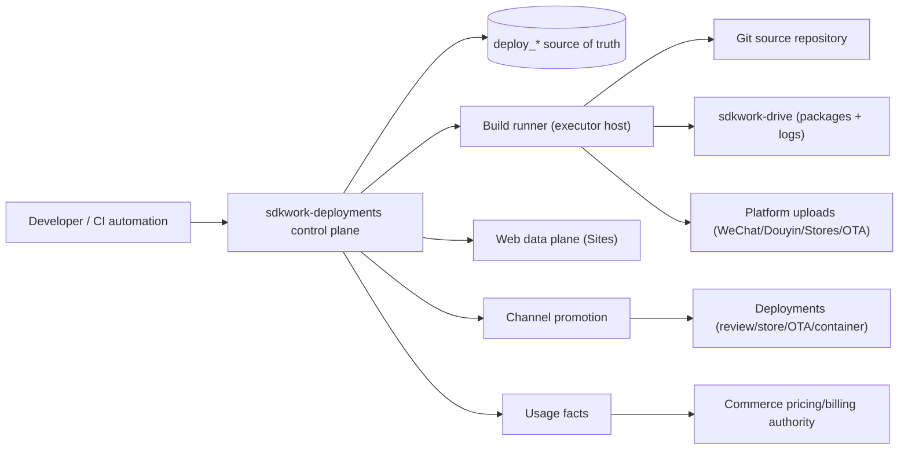

# ADR-20260804 Unified App Delivery Platform

Status: accepted
Requirement: REQ-2026-0002
Owner: SDKWork Deploy maintainers
Date: 2026-08-04
Specs: ARCHITECTURE_DECISION_SPEC.md, DOMAIN_SPEC.md, DATABASE_SPEC.md, DRIVE_SPEC.md,
SDK_SPEC.md, APP_SDK_INTEGRATION_SPEC.md, DEPLOYMENT_SPEC.md, SECURITY_SPEC.md,
PRIVACY_SPEC.md, OBSERVABILITY_SPEC.md, RELEASE_SPEC.md, MIGRATION_SPEC.md

## Context

The cloud publishing control plane models web Sites with live Drive/Wiki sources and preserves
`deploy_release` for frozen artifact workflows. The product surface now includes API service
applications, WeChat and Douyin mini-programs, iOS and Android applications (Flutter and native),
and HarmonyOS applications. These products are compiled from source into standardized packages,
released under semantic versions, promoted through channels, submitted to platform review, and
deployed through very different targets than a WebsiteRuntimeDescriptor.

The existing model cannot express:

- one business application with multiple platform targets from one source;
- a source repository with credential custody and commit snapshots;
- a build pipeline with toolchains, logs, and quality gates;
- a standardized immutable deployment package with provenance;
- a semantic version lifecycle with channels, promotion, retention, and rollback;
- deployment targets such as mini-program review, App Store/TestFlight, OTA, and containers.

## Decision

1. `deploy_app` is the tenant-owned application aggregate. `app_kind` enumerates
   `STATIC_WEB`, `SPA_WEB`, `API_SERVICE`, `WECHAT_MINIPROGRAM`, `DOUYIN_MINIPROGRAM`,
   `IOS_APP`, `ANDROID_APP`, and `HARMONYOS_APP`.
2. `deploy_app_platform_target` is the delivery unit inside an App: platform, tech stack
   (`FLUTTER`/`NATIVE`/`UNI_APP` or web/API stack), platform identity (bundle id, package name,
   app id, bundle name), build template reference, and allowed channels. A Flutter App has two
   platform targets (iOS, Android) sharing one source repository; an H5 App may also have a WeChat
   mini-program target when the source supports it.
3. Web delivery is unified into the App model. `deploy_app` owns web publishing
   configuration directly through `deploy_app_resource`, `deploy_app_variant`,
   `deploy_app_variant_rule`, `deploy_app_mount`, `deploy_app_binding`, and
   `deploy_app_revision`. The legacy `deploy_app` aggregate has been removed;
   every deployable belongs to exactly one App.
4. `deploy_source_repository` binds Git repositories to an App with secret-reference credentials.
   Deploy never stores tokens or private keys; the build runner receives credentials through
   rotatable secret files injected by the executor host.
5. `deploy_build_template` is the governed build recipe (toolchain contract, bounded commands,
   artifact output paths, quality gates). `deploy_build` records each execution with a strictly
   monotonic `build_number` per (App, platform target), an immutable source snapshot, a bounded
   state machine, a Drive-backed log reference, and produced package references. Only the Deploy
   control plane creates build rows; the build runner claims and executes them through a typed
   executor boundary.
6. `deploy_package` is the immutable deployment package. The package standard
   `sdkwork.deploy-package.v1` defines an in-package manifest and per-format validation rules
   covering web bundles, container image references/process bundles, mini-program archives with
   platform size ceilings, iOS IPA/archive bundle identity, Android APK/AAB package/signature
   requirements, and HarmonyOS HAP/APP bundle/API requirements. Drive remains the bytes owner;
   Deploy persists only bounded metadata and opaque references, never presigned URLs or object
   keys.
7. `deploy_release` is an immutable version record referencing exactly one package with a SemVer
   2.0.0 version. `(tenant, app, platform_target, semantic_version)` is unique.
   `deploy_release_channel` holds the current pointer per channel key; `deploy_channel_rollout`
   records immutable assignment/promotion history with strategy (immediate, percentage gray
   rollout, manual approval). Rollback is re-release of a prior immutable release.
8. `deploy_deployment` is extended with deployment kinds for `ARTIFACT_RELEASE`, `APP_CONFIG`,
   `TLS_CONFIG`, `MINIPROGRAM_REVIEW`, `STORE_SUBMISSION`, `OTA_DISTRIBUTION`,
   `ENTERPRISE_DISTRIBUTION`, and `CONTAINER_ROLLOUT`, plus target, strategy, platform review
   reference, percentage, and rollback linkage. The legacy integer status model is replaced by
   string enumerations (`deployment_status`, `deployment_kind`, `strategy`).
9. `deploy_signing_identity` models signing identities (iOS signing, Android keystore,
   HarmonyOS certificate profile, mini-program upload key) as opaque secret references with
   bounded metadata only. Signing executes inside the build runner host; key material never
   crosses the control-plane boundary.
10. Repository credentials, signing material, and platform upload secrets follow the TLS custody
    principle: secret references in ordinary columns only, material injected at the executor.
11. Build minutes, package storage, release/channel counts, and deployment counts become usage
    dimensions (`deploy_usage_event`) and entitlement projection inputs. Retention policies cover
    logs, packages, releases, and rollout history.
12. All mutations write audit rows; builds, packages, and releases are immutable after acceptance.
    Build retries reuse the claimed build row and never decrease `build_number`.

## Architecture View

## Alternatives

1. **Extend `deploy_app` to cover every application type.** Rejected: "Site" is web delivery
   vocabulary; mini-programs and mobile applications have no mounts, bindings, or variants, and a
   multi-platform product cannot be represented as one Site without distorting the delivery model.
2. **Parallel disjoint models (Site for web, separate tables for mobile).** Rejected: two
   top-level authorities fragment the version, channel, deployment, audit, and metering surfaces
   and force a future merge.
3. **Let the build runner own build state.** Rejected: the runner is an executor; Deploy remains
   the single writer for build, package, release, and deployment state, matching the
   control-plane authority principle.
4. **Store signing material and repository credentials in ordinary columns.** Rejected: it
   violates the established secret custody rule and would leak through list APIs and backups.
5. **Free-text versions with customer-chosen tags.** Rejected: promotion, ordering, rollback, and
   retention require a parseable, comparable, unique version contract.

## Consequences

- Every deployable now belongs to a tenant App with platform targets; web Sites keep working and
  gain an implicit App link.
- The deployment package standard and semver contract become the single language for frozen
  artifacts; the existing `deploy_artifact`/`deploy_release` rows remain readable and gain the new
  columns through additive migration.
- Build execution is bounded by validated templates; arbitrary customer commands are rejected.
- Actual signing and platform uploads require external credentials and environment
  (Xcode signing, WeChat upload, TestFlight) and are enabled only after credential
  integration; the executor contract, command construction, and state machine are implemented
  first.
- Database baseline, API contracts, generated SDKs, and permission changes require human review
  before implementation.
