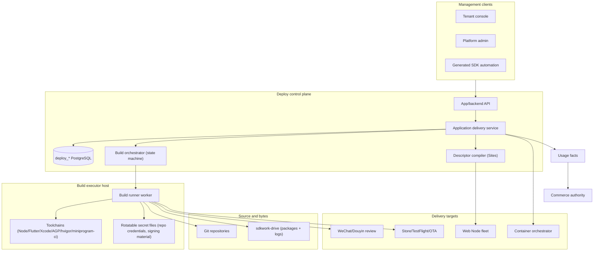

# SDKWork Unified App Delivery Control-Plane Architecture

Status: implementation in progress
Owner: SDKWork Deploy maintainers
Updated: 2026-08-04
Requirement: REQ-2026-0002
Decisions: ADR-2026-08-04-unified-app-delivery-platform
Specs: ARCHITECTURE_DECISION_SPEC.md, DOMAIN_SPEC.md, DATABASE_SPEC.md, DRIVE_SPEC.md,
API_SPEC.md, SDK_SPEC.md, APP_SDK_INTEGRATION_SPEC.md, CONFIG_SPEC.md, DEPLOYMENT_SPEC.md,
SECURITY_SPEC.md, PRIVACY_SPEC.md, PERFORMANCE_SPEC.md, OBSERVABILITY_SPEC.md, TEST_SPEC.md,
RELEASE_SPEC.md, MIGRATION_SPEC.md

## 1. Bounded Contexts

| Bounded context | System of record | Write owner | Public responsibility |
| --- | --- | --- | --- |
| Application delivery | `deploy_app*`, `deploy_build*`, `deploy_package`, `deploy_release*`, `deploy_deployment`, `deploy_signing_identity` | sdkwork-deployments | apps, platforms, source binding, builds, packages, versions, channels, deployments |
| Site publishing | `deploy_site*` | sdkwork-deployments | web Site delivery configuration (existing model) |
| Source repositories | external Git hosts | external | repository hosting, commit history |
| Files and directories | `dr_*` | sdkwork-drive | package bytes, build log bytes, storage, retention |
| HTTP/TLS runtime | runtime snapshots and observations | sdkwork-web-server | request routing/static/proxy/Wiki streaming/TLS |
| Container runtime | external orchestrator | external | container image execution |
| Platform review | WeChat/Douyin/App Store | external platforms | review decisions, submission state |
| Identity and permissions | IAM authority | sdkwork-iam/appbase | tenant/user/org/session/roles/permissions |
| Price and billing | Commerce authority | sdkwork-commerce | catalog/price/invoice/payment/tax/credit |

Deploy remains the single writer for application delivery state. The build runner executes
governed commands on an executor host and reports through typed contracts; it never mutates
business state directly. External Git hosts, Drive, container orchestrators, and platform review
systems are reached through owner SDKs or approved service ports with shared SDKWork
authentication; raw HTTP and manual auth headers are not accepted.

## 2. Logical Architecture



## 3. Core Domain Model

```text
App
  +- PlatformTarget[1..n]   platform / tech stack / identity / template / channels
  +- SourceRepository[0..n] Git binding with credential secret ref
  +- BuildTemplate[0..n]    governed recipe (toolchain contract, commands, gates)
  +- Build[0..n]            monotonic build_number, source snapshot, state machine, log
  +- Package[0..n]          immutable standardized package
  +- Release[0..n]          immutable semver -> Package
  +- Channel[1..n]          current release pointer
  |    +- ChannelRollout[0..n]  immutable assignment/promotion history
  +- Deployment[0..n]       typed target execution record
  +- SigningIdentity[0..n]  secret-reference signing identities

Site (existing) <-> App when app_kind is STATIC_WEB/SPA_WEB
```

Invariants:

- every active App has at least one active PlatformTarget;
- every PlatformTarget belongs to exactly one App;
- `build_number` is strictly monotonic per (App, PlatformTarget); it never decreases on retry;
- a Build may produce zero or one Package; a Package references exactly one Build and one
  PlatformTarget;
- a Release references exactly one Package; `(tenant, app, platform_target, semantic_version)`
  is unique;
- a Channel has at most one current release pointer at a time; every pointer change inserts an
  immutable ChannelRollout row;
- packages, builds, and releases are immutable after acceptance; lifecycle transitions append
  state, they do not mutate history;
- a Deployment references a Release and a target; platform review state is observed, never
  inferred;
- repository credentials, signing identities, and upload secrets exist only as opaque secret
  references in ordinary columns.

## 4. Portable Database Contract

The tables below extend the PostgreSQL/SQLite portable contract. All runtime business tables use
SDKWork-generated `BIGINT id`, stable `uuid`, tenant scope, audit timestamps/actors, lifecycle
state, and optimistic `version` per `DATABASE_SPEC.md`. Enum strings are canonical API/storage
vocabulary centralized in validation; no ad hoc integer meanings are introduced for new columns.
Legacy `deploy_deployment`/`deploy_artifact`/`deploy_release`/`deploy_site` numeric columns are
left readable; new state uses string enums.

### 4.1 `deploy_app`

Purpose: tenant-owned application aggregate.

| Column | Contract |
| --- | --- |
| `name`, `slug` | tenant display name and unique tenant slug |
| `app_kind` | `STATIC_WEB`, `SPA_WEB`, `API_SERVICE`, `WECHAT_MINIPROGRAM`, `DOUYIN_MINIPROGRAM`, `IOS_APP`, `ANDROID_APP`, `HARMONYOS_APP` |
| `description` | bounded description |
| `app_status` | `DRAFT`, `READY`, `ACTIVE`, `PAUSED`, `ARCHIVED`, `FAILED` |
| `site_id` | nullable link to `deploy_site` for web-kind Apps |
| `default_environment` | `development`, `test`, `staging`, `production` |
| `activated_at`, `paused_at`, `archived_at` | lifecycle observations |

Unique: `(tenant_id, slug)`. Index: `(tenant_id, app_status, updated_at)`.

Compatibility: a Site without an App behaves as an implicit `STATIC_WEB` or `SPA_WEB` App with
the same slug; no backfill row is required at runtime (resolved lazily and materialized on first
App-scoped write).

### 4.2 `deploy_app_platform_target`

| Column | Contract |
| --- | --- |
| `app_id` | owning App |
| `target_key` | stable App-local identity |
| `platform` | `WEB`, `API`, `WECHAT`, `DOUYIN`, `IOS`, `ANDROID`, `HARMONYOS` |
| `tech_stack` | `FLUTTER`, `NATIVE`, `UNI_APP`, `NODE`, `RUST`, `GO`, `JAVA`, `OTHER` |
| `bundle_id` / `package_name` / `app_id` / `bundle_name` | nullable platform identity, exact per platform |
| `build_template_id` | nullable default build template |
| `allowed_channels_json` | bounded channel key list |
| `target_status` | `DRAFT`, `ACTIVE`, `PAUSED`, `ARCHIVED` |

Unique: `(app_id, target_key)`. One active default target per platform per App.

### 4.3 `deploy_source_repository`

| Column | Contract |
| --- | --- |
| `app_id` | owning App |
| `repo_key` | stable App-local identity |
| `repo_provider` | `GITHUB`, `GITEE`, `GITLAB`, `SELF_HOSTED` |
| `repo_url` | bounded normalized URL, no credentials embedded |
| `default_branch` | bounded branch name |
| `clone_mode` | `FULL`, `SHALLOW` |
| `credential_secret_ref` | opaque secret reference; never material |
| `repo_status` | `PENDING`, `VALIDATED`, `INVALID`, `REVOKED`, `ARCHIVED` |
| `last_validated_at`, `last_error_code` | validation observation |

Unique: `(app_id, repo_key)` and `(tenant_id, repo_url, repo_status)` active index.

### 4.4 `deploy_build_template`

| Column | Contract |
| --- | --- |
| `template_name`, `template_version` | named, versioned recipe |
| `platform`, `tech_stack` | applicability |
| `toolchain_json` | bounded toolchain contract (language, versions, environment image) |
| `commands_json` | bounded ordered command list with allowlisted prefixes; no shell escape |
| `artifact_outputs_json` | bounded artifact path patterns |
| `quality_gates_json` | bounded gate summary contract |
| `template_status` | `DRAFT`, `ACTIVE`, `SUPERSEDED`, `ARCHIVED` |

Unique `(tenant_id, template_name, template_version)`.

### 4.5 `deploy_build`

| Column | Contract |
| --- | --- |
| `app_id`, `platform_target_id`, `template_id` | execution scope |
| `build_number` | strictly monotonic per (App, PlatformTarget) |
| `source_repository_id` | primary repository |
| `source_ref` | branch/tag/commit requested |
| `source_snapshot_json` | immutable snapshot: commit SHA, branch/tag, message, author, tree summary |
| `build_status` | `QUEUED`, `PREPARING`, `COMPILING`, `TESTING`, `PACKAGING`, `SUCCEEDED`, `FAILED`, `CANCELLED`, `TIMED_OUT` |
| `log_ref` | opaque Drive reference to the streamed log |
| `produced_package_id` | nullable produced Package |
| `quality_gate_json` | bounded gate summary |
| `runner_node_uuid`, `runner_version` | executing runner identity |
| `started_at`, `finished_at`, `duration_ms` | timing evidence |
| `error_code` | stable bounded failure code |
| `idempotency_key` | tenant-scoped request idempotency |

Unique `(tenant_id, app_id, platform_target_id, build_number)`. Index
`(app_id, build_status, updated_at)` for queue scans and `(app_id, created_at DESC)` for history.
The claim transition is transactional: a worker claims a `QUEUED` row under a bounded claim
expiry, reuses the row on retry, and never renumbers.

### 4.6 `deploy_package`

Purpose: immutable standardized deployment package.

| Column | Contract |
| --- | --- |
| `app_id`, `platform_target_id`, `build_id` | provenance |
| `package_format` | `DIST_DIR`, `ZIP`, `APK`, `AAB`, `IPA`, `XCARCHIVE`, `HAP`, `APP`, `OCI_IMAGE`, `PROCESS_BUNDLE`, `TAR_GZ` |
| `semantic_version` | SemVer 2.0.0, bounded |
| `package_size_bytes`, `checksum_sha256` | byte evidence |
| `manifest_sha256` | canonical digest of the in-package manifest |
| `drive_ref_json` | bounded opaque Drive references (node/space ids), no keys/URLs |
| `signing_identity_id` | nullable signing identity |
| `min_platform_version` | nullable `minSdk`/minimum iOS/API version |
| `arch_json` | bounded ABI/architecture list |
| `bundle_identity_json` | bounded platform identity snapshot (bundle id/package name/app id) |
| `package_status` | `DRAFT`, `VALIDATED`, `READY`, `SUPERSEDED`, `RETIRED`, `ARCHIVED` |
| `validation_report_json` | bounded per-format validation evidence |

Unique `(tenant_id, app_id, platform_target_id, semantic_version, build_id)`; index
`(app_id, platform_target_id, created_at DESC)`.

### 4.7 `deploy_release`

Purpose: immutable version record referencing one package.

| Column | Contract |
| --- | --- |
| `app_id`, `platform_target_id`, `package_id` | immutable references |
| `semantic_version` | SemVer 2.0.0, bounded |
| `build_number` | denormalized provenance from the package build |
| `release_status` | `DRAFT`, `ACTIVE`, `SUPERSEDED`, `DEPRECATED`, `RETIRED`, `ARCHIVED` |
| `release_notes_json` | bounded notes |
| `idempotency_key` | tenant-scoped request idempotency |

Unique `(tenant_id, app_id, platform_target_id, semantic_version)`. Rows are append-only except
lifecycle status transitions; content never changes.

### 4.8 `deploy_release_channel` And `deploy_channel_rollout`

`deploy_release_channel`:

| Column | Contract |
| --- | --- |
| `app_id`, `platform_target_id` | scope |
| `channel_key` | `stable`, `beta`, `alpha`, `qa` |
| `current_release_id` | nullable current release pointer |
| `channel_status` | `ACTIVE`, `PAUSED`, `ARCHIVED` |

Unique `(app_id, platform_target_id, channel_key)`.

`deploy_channel_rollout` (append-only):

| Column | Contract |
| --- | --- |
| `channel_id`, `release_id` | assignment |
| `strategy` | `IMMEDIATE`, `PERCENTAGE`, `MANUAL_APPROVAL` |
| `percentage` | bounded 1..=100 for `PERCENTAGE` |
| `rollout_status` | `PENDING`, `ROLLING`, `COMPLETED`, `ROLLED_BACK`, `FAILED`, `CANCELLED` |
| `supersedes_rollout_id` | nullable previous rollout |
| `requested_by`, `requested_at`, `completed_at` | evidence |

The channel current pointer and the rollout row commit in one transaction; a newer rollout
fences an older one.

### 4.9 `deploy_deployment` (extended)

Additive columns on the existing table:

| Column | Contract |
| --- | --- |
| `app_id`, `platform_target_id`, `release_id` | new-model references (existing `site_id`/`release_id` remain) |
| `deployment_kind` | `ARTIFACT_RELEASE`, `SITE_CONFIG`, `TLS_CONFIG`, `MINIPROGRAM_REVIEW`, `STORE_SUBMISSION`, `OTA_DISTRIBUTION`, `ENTERPRISE_DISTRIBUTION`, `CONTAINER_ROLLOUT` |
| `deployment_target` | `WEB_NODE`, `CONTAINER`, `WECHAT_REVIEW`, `DOUYIN_REVIEW`, `APP_STORE_CONNECT`, `TESTFLIGHT`, `OTA`, `ENTERPRISE`, `HARMONYOS_STORE` |
| `strategy` | `IMMEDIATE`, `PERCENTAGE`, `MANUAL_APPROVAL` |
| `percentage` | nullable bounded 1..=100 |
| `platform_review_ref` | bounded platform review/submission reference |
| `deployment_status` | `PENDING`, `SUBMITTING`, `PENDING_REVIEW`, `IN_REVIEW`, `REJECTED`, `APPROVED`, `LIVE`, `ACTIVE`, `DEGRADED`, `FAILED`, `ROLLED_BACK`, `CANCELLED` |
| `rollback_from_deployment_id` | nullable rollback linkage |

Legacy numeric `deploy_type`/`status` columns remain readable; new state uses the string
columns. Indexes: `(app_id, created_at DESC)`, `(deployment_status)` partial for active kinds.

### 4.10 `deploy_signing_identity`

| Column | Contract |
| --- | --- |
| `identity_name` | tenant display name |
| `signing_kind` | `IOS_SIGNING`, `ANDROID_KEYSTORE`, `HARMONYOS_CERT_PROFILE`, `MINIPROGRAM_UPLOAD_KEY`, `API_REPO_TOKEN` |
| `platform_target_id` | nullable applicability |
| `fingerprint_sha256` | public fingerprint only |
| `expires_at` | nullable expiry observation |
| `secret_ref` | opaque secret reference; never material |
| `identity_status` | `PENDING`, `VALID`, `EXPIRED`, `REVOKED`, `ARCHIVED` |

No key, keystore, password, or upload token column exists.

## 5. Deployment Package Standard `sdkwork.deploy-package.v1`

### 5.1 In-Package Manifest

Every package contains one manifest document. For directory-based formats
(`DIST_DIR`, `ZIP`, `APK`, `AAB`, `IPA`, `HAP`, `APP`, `PROCESS_BUNDLE`, `TAR_GZ`) the manifest
is embedded at a fixed path; for `OCI_IMAGE` it is carried as an image label/annotation. The
canonical payload excludes its own `manifestSha256` field and is hashed with recursively ordered
keys (same canonicalization as the website runtime compiler).

```json
{
  "schemaVersion": "sdkwork.deploy-package.v1",
  "kind": "sdkwork.deploy-package.manifest",
  "packageUuid": "stable-package-uuid",
  "appUuid": "stable-app-uuid",
  "platformTargetUuid": "stable-target-uuid",
  "platform": "ANDROID",
  "packageFormat": "APK",
  "semanticVersion": "1.4.2",
  "buildNumber": 117,
  "buildUuid": "stable-build-uuid",
  "sourceCommit": "full-commit-sha",
  "sourceRef": "refs/tags/v1.4.2",
  "sourceRepositoryUuid": "stable-repo-uuid",
  "toolchainVersion": "flutter/3.24.3-jdk/17",
  "artifactHashSha256": "sha256-of-package-bytes",
  "packageSizeBytes": 42108123,
  "signingIdentityFingerprint": "optional-public-fingerprint",
  "minPlatformVersion": "minSdk 24",
  "architectures": ["arm64-v8a", "armeabi-v7a"],
  "bundleIdentity": {
    "packageName": "com.sdkwork.example",
    "applicationId": null,
    "bundleId": null,
    "bundleName": null
  },
  "sbomRef": "opaque-sbom-reference",
  "builtAt": "2026-08-04T00:00:00Z",
  "compilerVersion": "sdkwork-deploy-package-validator/1"
}
```

`artifactHashSha256` covers the complete package bytes (or the image digest for `OCI_IMAGE`);
`manifestSha256` covers only the manifest. Both must match the `deploy_package` row before a
Release may reference it.

### 5.2 Per-Format Validation Rules

| format | Required checks |
| --- | --- |
| `DIST_DIR`/`TAR_GZ` (web) | bounded tree, index entry present, no secrets, size ceiling |
| `ZIP` (mini-program) | platform manifest entry present (`app.json` for WeChat), main/total size ceilings (WeChat 2 MiB main / 20 MiB total by policy), no absolute paths or traversal |
| `APK`/`AAB` | package name present, `minSdk`/`targetSdk` parse, ABI list bounded, signature verification required for release |
| `IPA`/`XCARCHIVE` | bundle identifier present, minimum iOS version parse, signing identity required for release |
| `HAP`/`APP` | bundle name present, API version parse, signing profile requirement recorded |
| `OCI_IMAGE` | digest present, image reference bounded, no live-registry writes from Deploy |
| `PROCESS_BUNDLE` | binary + entry contract present, size ceiling |

Validation is executed by the package validator on the byte store boundary (through Drive);
Deploy persists only the bounded report and the manifest digest.

## 6. Build Pipeline

### 6.1 State Machine

```text
QUEUED -> PREPARING -> COMPILING -> TESTING -> PACKAGING -> SUCCEEDED
   |          |            |           |           |
   +---- FAILED (any state, stable error_code)
QUEUED/PREPARING -> CANCELLED (operator)
any active -> TIMED_OUT (bounded deadline)
```

Transitions are transactional with audit. A failed build may be retried as a new claim on the
same row only while `build_status` is terminal-failed and the retry policy permits it; the
`build_number` never changes.

### 6.2 Executor Boundary

The build runner crate exposes a `BuildExecutor` trait:

```rust
pub trait BuildExecutor {
    fn plan(&self, ctx: &ExecutionContext) -> Result<CommandPlan, ExecutorError>;
    async fn execute(&self, ctx: &ExecutionContext, plan: &CommandPlan) -> Result<ExecutionOutcome, ExecutorError>;
}
```

- the orchestrator (control plane) creates `deploy_build` rows and exposes a claim API;
- the runner claims builds, prepares the workspace (clone via secret-file-injected credentials),
  runs the template commands through the chosen executor, streams the log to Drive, collects the
  artifact, validates the package, and records the result through the generated Deploy service
  port;
- platform executors (flutter, xcodebuild, gradle, hvigor, miniprogram-ci) are command
  constructors with environment checks; signing/upload commands are constructed only when the
  corresponding signing identity secret file is present and valid;
- runner node identity, version, and bounded resource limits are recorded on every build.

### 6.3 Retry, Claim, And Recovery

Bounded claim expiry (configurable seconds), durable next-attempt time, and a bounded keyset
scan of stale active builds recover interrupted executions. A claimed build is fenced by
`runner_node_uuid`; another runner cannot claim the same row while the claim is valid. On crash,
the claim expires and a new runner resumes from the last committed state; logs remain append-only
references.

## 7. Version Management

### 7.1 Semantic Versioning

- releases use SemVer 2.0.0: `MAJOR.MINOR.PATCH[-prerelease][+build]`, bounded length, no
  leading zeros, prerelease identifiers bounded;
- ordering follows SemVer precedence; build metadata is ignored for precedence but retained for
  identity;
- `(tenant, app, platform_target, semantic_version)` unique, enforced transactionally with a
  conflict-safe claim strategy;
- `build_number` provides the strictly monotonic ordering axis per target; a higher `build_number`
  can never be superseded by a lower one.

### 7.2 Channels And Promotion

- channel keys are `stable`, `beta`, `alpha`, `qa`; allowed sets are bounded per platform target;
- promotion assigns an existing immutable Release to a Channel: one transaction writes the new
  `deploy_channel_rollout` row, fences the previous rollout, and updates `current_release_id`;
- gray rollout: `strategy=PERCENTAGE` with bounded percentage; completion evidence is a separate
  rollout observation, not an inference;
- rollback: promote the prior release again; history keeps both rows and the rollback linkage.

### 7.3 Lifecycle And Retention

- release lifecycle: `DRAFT -> ACTIVE -> SUPERSEDED/DEPRECATED -> RETIRED -> ARCHIVED`;
- retiring a release does not delete packages; retention policies bound package storage, log
  retention, and rollout history; audit rows are never deleted;
- promotion into a channel of a `RETIRED`/`ARCHIVED` release is rejected.

### 7.4 Traceability Chain

One bounded query resolves `source_commit -> build -> package -> release -> channel rollout ->
deployment` through stable UUIDs. The chain contains no secret material; package logs are
referenced, not copied, into release records.

## 8. API And SDK Boundaries

Target resource groups:

- app API: `apps`, `platformTargets`, `sourceRepositories`, `buildTemplates`, `builds`,
  `packages`, `releases`, `channels`, `channelRollouts`, `deployments`, `signingIdentities`;
- backend API: build fleet/queue administration, runner health, package registry, version
  registry, signing identity health, metering reconciliation;
- generated `@sdkwork/deployments-app-sdk` and `@sdkwork/deployments-backend-sdk` facades are the
  only supported automation surfaces; raw HTTP is not accepted;
- Drive App SDK remains the bytes path for package/log upload; Drive references stay opaque.

All list and search operations are store-paginated and bounded; mutations carry
`Idempotency-Key` where the operation is retryable (build trigger, release creation, promotion,
deployment creation). Backend build administration and forced operations require approved
permission models and audit.

## 9. Security And Privacy Architecture

- tenant predicates on every management and provider request; cross-tenant reads fail closed;
- secret references only in ordinary columns; secret files are injected at the executor host
  with rotation; zeroization applies to temporary material;
- template commands are allowlisted and bounded; path escape and ungoverned execution are
  rejected at template validation and at executor plan time;
- package validation confines reads to the package root; traversal and symlink escape are
  rejected;
- logs are tenant-scoped, bounded, and redacted (no credentials, keys, or upload tokens);
- platform review references are treated as external observations; never inferred as approval;
- audit covers every app/build/package/release/channel/deployment/signing mutation.

## 10. Reliability And Failure Semantics

| Failure | Required behavior |
| --- | --- |
| Executor host down | claim expires; build resumes from last committed state; queue depth visible |
| Toolchain failure | stable error code, log preserved, no package |
| Package validation failure | package marked invalid; release creation rejected |
| Channel promotion conflict | transactional fence; previous rollout unchanged |
| Drive unavailable | packages/logs unreadable fail closed; management fails explicitly |
| Platform review unavailable | submission retried with backoff; state stays `SUBMITTING` |
| Build runner crash mid-upload | log append-only; package registration is idempotent |

## 11. Observability

Correlation fields: `trace_id`, `tenant_id` (restricted), `app_uuid`, `platform_target_uuid`,
`build_uuid`, `build_number`, `package_uuid`, `release_uuid`, `channel_key`,
`deployment_uuid`, `runner_uuid`.

Required metrics: build queue depth/age, claim-to-start latency, build duration by
state/kind/result, package validation latency/failures, release creation rate, promotion
latency, deployment duration by kind/result, runner capacity/health, Drive upload latency,
platform submission latency, retention backlog.

## 12. Capacity And Limits

Every template, command, source snapshot, manifest, validation report, rollout history, and
log is bounded. Product plan limits may be lower than platform safety ceilings but never higher.
Capacity planning separates build concurrency, toolchain image scale, log volume, package
storage, release/channel volume, and platform submission rate.

## 13. Implementation Sequence

1. Phase 1 (this iteration): REQ/ADR/PRD/TECH approval, portable schema extension, contract
   types and validators (semver, package manifest, app-kind rules), repository/service/routes,
   app/backend OpenAPI and materialization, build runner crate with executor boundary and
   command executors, unit and contract tests.
2. Web/API delivery: web-kind App-Site linking, artifact/site-config deployment kinds reuse.
3. Mini-program delivery: platform targets, package validation ceilings, review submission
   executor after credential integration.
4. Mobile/HarmonyOS delivery: signing identity enforcement, TestFlight/store/OTA executors.
5. Commercial GA: entitlement/usage reconciliation, retention enforcement, SLO dashboards,
   staged rollout, external review.

## 14. Verification Matrix

| Boundary | Evidence |
| --- | --- |
| Documentation/trace | repository docs validator, REQ/ADR/migration links |
| Database | contract validator, migration plan/drift, tenant/index tests |
| API/SDK | envelope, operation, pagination, owner-generation, consumer-import checks |
| Versioning | semver parse/compare/precedence, uniqueness, monotonic build_number, promotion fence |
| Package standard | manifest canonical hash, per-format validation rules, size ceilings |
| Build pipeline | state machine transitions, claim fencing, retry, log capture, runner identity |
| Traceability | source->build->package->release->channel->deployment single-query resolution |
| Security/privacy | tenant isolation, secret reference-only custody, template allowlist, log redaction |
| Reliability | runner crash recovery, claim expiry, promotion conflict, retention |
| UI | tenant/admin E2E including async and permission states |
